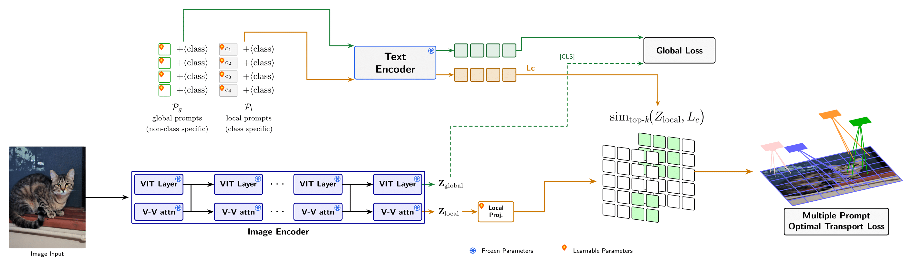

# SOT-GLP
SOT-GLP: Sparse Optimal Transport Guided Local-Global Prompt Learning

## Architecture



## Datasets

To prepare the datasets for few-shot image classification and domain generalization experiments, please follow the dataset preparation guidelines in the [CoOp](https://github.com/KaiyangZhou/CoOp/blob/main/DATASETS.md) repository. The class names and data splits (e.g., `split_zhou_Caltech101.json`) are already included in the `sot-glp/datasets` folder, so separate downloads are not necessary.

For out-of-distribution (OOD) evaluation, we use four benchmark datasets: [iNaturalist](https://arxiv.org/abs/1707.06642), [SUN](https://vision.princeton.edu/projects/2010/SUN/), [Places](https://arxiv.org/abs/1610.02055), and [Texture](https://arxiv.org/abs/1311.3618), as curated by [Huang et al. 2021](https://arxiv.org/abs/2105.01879). Instructions for downloading these OOD datasets can be found in the [large_scale_ood repository](https://github.com/deeplearning-wisc/large_scale_ood#out-of-distribution-dataset).

### Expected Directory Structure

Organize your datasets according to the following directory structure:

```
$DATA_FOLDER/
├––––Imagenet/
│    ├–––train/
│    └––val/
├––––imagenetv2-matched-frequency-format-val/
├––––imagenet-a/
├––––imagenet-r/
├––––sketch/
├––––caltech101/
│    └––101_ObjectCategories/
├––––EuroSAT_RGB/
├––––dtddataset/
│    └–dtd/
│        └––images/
├––––fgvc-aircraft-2013b/
├––––flowers102/
├––––food-101/
│    └––images/
├––––oxford-iiit-pet/
│    └––images/
├––––stanford_cars/
├––––SUN397/
├––––UCF-101-midframes/
└––––ood_data/
     ├–––iNaturalist/
     ├–––SUN/
     ├–––Places/
     └–––dtd/
         └––images/
```
